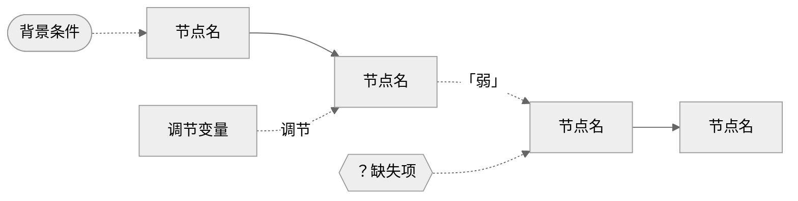

# 因果机制图项目：AI 辅助机制分析与可视化工作流

## 项目定位

这不是一个"让 AI 帮你画图"的作业。核心任务是：**用 AI 暴露你机制推理中的薄弱环节，然后由你自己完成最终的因果判断。** AI 是迫使你把机制说清楚、把箭头逐一审查的工具，不是替你思考的替代品。

最终提交物需要同时呈现两样东西：
- 一张经过审计和人工修改的因果机制图（终稿）
- 一份完整的 AI 协作过程记录（提示词、AI 输出、你的判断与修改）

---

## 工作流总览

```
Step 1  文字→箭头骨架          ← causal-mechanism-arrow
Step 2  因果机制审计            ← causal-mechanism-audit
Step 3  输出 Mermaid 初稿代码   ← causal-mechanism-viz
Step 4  图形逻辑审查与修改建议  ← causal-mermaid-graph-audit
Step 5  人工修改终稿            ← 你的因果判断
Step 6  终稿说明 + 三个反思     ← causal-mechanism-reflection-writer
```

中间四个步骤由 AI skill 执行，但每一步的**判断权**在你手上。具体来说：

| 步骤 | AI 做什么 | 你做什么 |
|------|----------|---------|
| Step 1 | 从文字中提炼 X→M1→M2→Y 骨架 | 确认主链是否准确，节点命名是否反映你的本意 |
| Step 2 | 三模块审计（因果诊断+位置审查+缺失诊断） | 判断哪些审计结论成立，哪些过于严苛或宽松 |
| Step 3 | 按审计结论生成 Mermaid 代码 | 检查代码是否忠实表达了你的机制 |
| Step 4 | 检查 Mermaid 图的因果表达是否正确 | 决定接受还是拒绝每条修改建议 |
| Step 5 | 不参与 | **你亲手改图**，这是整个流程中最关键的一步 |
| Step 6 | 根据终稿和修改记录生成文字初稿 | 编辑、调整语气、加入你自己的判断 |

---

## 各步骤详细说明

### Step 1：从自然语言到箭头形式

**输入**：一段或多段描述因果机制的自然语言（你论文中的机制段落）。

**AI 操作**：调用 `causal-mechanism-arrow`，输出：

```
【研究问题】
【主链】X → M1 → M2 → Y
【节点说明】每个节点 4-10 字 + 一句解释
【箭头说明】每条箭头一句话解释因果动力
【暂不放入主链的因素】背景条件、调节变量、替代解释、可能缺失节点
```

**你的任务是确认**：
- 主链是否捕捉了你最核心的因果主张？（不是把所有东西都塞进一条链）
- 每个节点的命名是否准确？（4-10 字的压缩是否丢失了关键信息）
- 被移出主链的因素分类是否正确？（背景条件和调节变量容易混淆）

**[过程记录要点]**
- 贴出你给 AI 的原始机制文字
- 贴出 AI 输出的箭头骨架
- 说明你修改了什么、为什么修改。例如："AI 将 X 识别为____，但我的本意是____，因此我将节点名改为____"

---

### Step 2：因果机制审计

**输入**：Step 1 的完整输出（箭头骨架 + 辅助因素）。

**AI 操作**：调用 `causal-mechanism-audit`，执行三个模块：

| 模块 | 核心问题 |
|------|---------|
| A 因果诊断三问 | 每条箭头真的是因果吗？（第三变量 / 反向因果 / 稳健性） |
| B 变量位置审查 | 每个变量在图中的位置对吗？（主链/背景/调节/替代/问号/文字） |
| C 缺失诊断 | 图里缺了什么？（缺失行动者/负案例/时间顺序/替代路径/数据/反事实） |

**关键输出**：
- 模块 A 的诊断表（每条箭头的综合判断：强/中/弱）
- 最弱箭头及其风险来源
- 模块 C 的缺失严重程度（MCAR / MAR / MNAR）

**你的任务是判断**：
- 最弱箭头的判断是否合理？你觉得弱在哪里？
- 模块 C 的缺失是否准确？有没有 AI 没看到的缺失？
- 哪些审计结论你需要采纳，哪些你觉得过于严苛？

**[过程记录要点]**
- 贴出审计结果的核心内容（截取诊断表中最弱箭头的部分）
- 说明你同意或不同意审计结论的理由
- 如果有你发现的但 AI 没指出的问题，补充说明

---

### Step 3：输出 Mermaid 初稿代码

**输入**：Step 2 的审计结论。

**AI 操作**：调用 `causal-mechanism-viz`，生成 Mermaid flowchart 代码：



代码可直接复制到 Typora 或 Obsidian 中渲染成图。

**你的任务是**：
- 检查生成的代码在 Typora/Obsidian 中是否能正常渲染
- 确认图中的元素类型和位置是否符合你的意图
- 这一步不需要修改图的结构——那是 Step 5 的事

**[过程记录要点]**
- 贴出 AI 生成的 Mermaid 代码
- 贴出渲染后的截图（或者说明渲染是否成功）
- 记录你对初稿的初步印象：哪里看起来不对劲？

---

### Step 4：图形逻辑审查与修改建议

**输入**：Step 3 的 Mermaid 代码 + Step 2 的审计结论（作为对照基准）。

**AI 操作**：调用 `causal-mermaid-graph-audit`，执行七项检查：

| 检查项 | 严重程度 |
|--------|---------|
| 1. 背景条件是否误入主链 | 高 |
| 2. 调节变量是否被误画为中介机制 | 高 |
| 3. 替代解释的位置与指向是否清晰 | 中 |
| 4. 最弱环节是否被可视化 | 中 |
| 5. 看不见的缺失是否被可视化 | 中 |
| 6. 图形复杂度是否掩盖主链 | 低 |
| 7. Mermaid 语法是否存在渲染风险 | 高 |

**输出**：一份审查报告，标注每项检查的状态（✅/⚠️/❌），并附逐条修改指令。

**你的任务是**：
- 逐条决定：采纳这个修改建议，还是不采纳？
- 不采纳时，写下你的理由（这本身就是过程记录的重要部分）
- 将采纳的修改建议整理成修改清单，留给 Step 5

**[过程记录要点]**
- 贴出审查报告的修改优先级列表
- 逐条说明你采纳或拒绝了哪些建议，以及为什么
- 这是展示你因果判断能力的关键环节——AI 指出问题，你决定怎么处理

---

### Step 5：人工修改终稿（最关键的一步）

**输入**：Step 4 的修改建议 + 你自己的因果判断。

**你的操作**：
1. 根据采纳的修改建议，手动修改 Mermaid 代码
2. 在 Typora/Obsidian 中重新渲染，确认效果
3. 做 AI 没有建议但你认为必要的修改——**这一步是展示你因果判断力的核心**

**终稿应呈现**：
- 一条清晰的主链（视觉上最突出）
- 正确的辅助元素位置（背景条件在图上、调节变量在箭头旁、替代解释为旁支）
- 最弱环节被可视化（虚线或标注）
- 看不见的缺失被标记（问号节点）
- 不再有渲染问题

**[过程记录要点]**
- 贴出你修改后的最终 Mermaid 代码
- 贴出渲染后的终稿截图
- 详细说明你自己做了哪些 AI 没建议的修改，以及为什么
- **这部分是作业中最值钱的内容**——它证明了你具备 AI 不具备的因果判断能力

---

### Step 6：终稿说明与三个反思

**输入**：前五步的所有输出 + 你的修改记录。

**AI 操作**：调用 `causal-mechanism-reflection-writer`，生成两类正文：

1. **机制图终稿说明**（三段）：
   - 主链说明（核心因果逻辑）
   - 辅助元素说明（各类元素的位置逻辑）
   - 修改说明（初稿问题 + 修改依据 + 仍待实证之处）

2. **三个交付思考**（三段，各 150-250 字）：

   **思考一：从文字到箭头，你压缩了什么？**
   - 聚焦一个最重要的压缩决策
   - 说明移出的依据（区分背景条件/调节变量/替代解释的逻辑）
   - 压缩后主链保留了什么核心主张

   **思考二：最弱的一环在哪里，如何补强？**
   - 哪条箭头最弱，三问中哪项风险最高
   - 弱在哪里（不是"证据不足"，而是具体的方法论问题）
   - 具体的补强策略（过程追踪哪个环节、找什么证据、在什么案例中找）

   **思考三：图中是否存在看不见的缺失，是否构成硬伤？**
   - 最重要的缺失是什么
   - MCAR / MAR / MNAR 判断
   - 是否构成硬伤，如何处理

**你的任务**：
- AI 生成的文字只是初稿
- 编辑和改写，使其符合你的学术表达风格
- 补充 AI 无法知道的信息（你的真实补强计划、你的真实判断）
- 确保三个反思都有具体的、来自你研究的内容支撑

---

## 提交物格式

推荐两种格式同时提交：

### Word 文档（主提交物）
- 第 1 页：机制图终稿（截图插入）
- 第 2 页：机制图终稿说明（三段）
- 第 3-4 页：三个交付思考

### Markdown 文件（过程记录）
- 按 Step 1-6 顺序组织
- 每个步骤包含：你的输入 → AI 输出 → 你的判断/修改
- 关键环节贴代码和截图
- 终稿 Mermaid 代码放在最后

---

## 评分视角：审核者会看什么

1. **终稿图的质量**：主链清晰吗？辅助元素位置对吗？最弱环节和缺失标记了吗？
2. **AI 使用的质量**：你让 AI 做了什么，你是如何与 AI 对话的？不是"AI 替我做了"，而是"我指挥 AI 做了审计，然后我判断了哪些结论可信"。
3. **你的因果判断力**：修改记录中最重要的是你**自己做的修改**和**你不同意 AI 的地方**。这里展示了你的独立思考。
4. **三个反思的深度**：
   - 思考一：不只是"压缩了什么"，而是说明压缩的依据（分类逻辑）
   - 思考二：不只是"哪条弱"，而是说明弱在哪个具体的方法论维度 + 怎么补强
   - 思考三：不只是"有缺失"，而是用 MCAR/MAR/MNAR 框架做判断 + 坦然面对
5. **过程记录的完整性**：审核者应该能从过程记录中看到你的思考轨迹，而不只是结果。

---

## 常见错误

| 错误 | 正确做法 |
|------|---------|
| 过程记录只贴 AI 输出，没有你的判断 | 每个步骤都要写"我同意/不同意/修改了什么，因为……" |
| 终稿图和 AI 初稿完全一样 | 说明你没有做人工修改——这意味着你绕过了最核心的步骤 |
| 三个反思过于笼统（"需要更多证据""未来研究可以补充"） | 每个反思都要有具体的、来自你研究的内容 |
| 提交物只有图没有过程记录 | 过程记录是作业的主体，图是结果 |
| 把 AI 审计结论当真理，不质疑 | 审计是工具，判断是人的事。作业要看的就是你怎么判断 |
