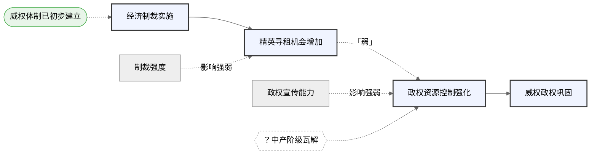

[↑ 工作流总览](../workflow/00-overview.md) • [返回 README](../README.md)

# 完整案例：经济制裁与威权政权巩固

## 研究问题
为什么经济制裁有时反而强化了目标国的威权政权？

## Step 1 输出（箭头骨架）
### 输入文字
"经济制裁→稀缺性→精英寻租空间增加→精英利益与政权绑定→政权借外敌叙事集中经济部门控制→资源控制权集中→反对派压制能力增强→威权政权巩固。初始威权程度影响此机制的激活。制裁强度和反对派组织能力调节传导效果。"

### 输出骨架
【主链】经济制裁实施 → 精英寻租机会增加 → 政权资源控制强化 → 威权政权巩固

【节点说明】
- X：经济制裁实施 — 国际行为体对目标国施加的经济限制措施
- M1：精英寻租机会增加 — 制裁造成稀缺性，使精英通过管控稀缺品获得寻租空间
- M2：政权资源控制强化 — 精英利益与政权绑定后，政权借外敌叙事集中经济部门控制
- Y：威权政权巩固 — 政权具备更强的反对派压制与忠诚购买能力

【暂不放入主链的因素】
- 背景条件：威权体制已初步建立；可被动员的民族主义情绪
- 调节变量：制裁强度与范围；反对派原有组织能力
- 替代解释：制裁强度不足；国际制裁协调失败
- 可能缺失节点：M1→M2之间缺少"中产阶级瓦解"的独立路径

## Step 2 输出（审计结果）

### 模块A：因果诊断三问

| 箭头 | 第三变量风险 | 反向因果风险 | 稳健性风险 | 综合 |
|------|------------|------------|----------|------|
| X→M1 | 中：初始威权程度可能同时决定制裁概率和精英依附度 | 低：制裁先于寻租，顺序明确 | 中：寻租机会可通过其他路径产生 | 中 |
| M1→M2 | 高：政权宣传能力可独立激活外敌叙事，绕过M1 | 中：政权可能在制裁前已启动资源集中 | 高：移除此箭头主链即断裂 | 弱 |
| M2→Y | 低：资源控制直接支撑政权巩固，无明显共因 | 低：控制先于巩固 | 中：政权巩固还可依赖镇压等其他路径 | 中 |

**四项结论：**
1. 最稳箭头：M2→Y
2. 最弱箭头：M1→M2
3. 必须画进图里：政权宣传能力作为M1→M2旁的调节变量
4. 只需文字交代：制裁强度不足的替代解释可在案例选择段落说明

### 模块B：变量位置审查
- 调节变量"制裁强度"标注在X→M1箭头旁
- "政权宣传能力"从文字说明升级为图中调节变量（标在M1→M2旁）
- "中产阶级瓦解"标为问号节点，位于M1与M2之间

### 模块C：缺失诊断
- 缺失负案例（MAR）：3个案例均为制裁未能削弱政权，缺乏制裁成功的对照；可通过增加乌克兰2014等案例补救
- 缺失反事实（MNAR潜在风险）：无法说明若制裁不实施，威权政权是否同样会巩固

## Step 3 输出（Mermaid 初稿）

## Step 4 输出（图形审查结果）

### 语法检查
✅ 无问题

### 因果表达检查
| 检查项 | 状态 | 修改建议 |
|--------|------|---------|
| 1. 背景条件位置 | ✅ | — |
| 2. 调节变量位置 | ✅ | — |
| 3. 替代解释位置 | ✅ | 无入图替代解释，均在文字交代 |
| 4. 最弱环节标注 | ✅ | M1→M2已标注「弱」 |
| 5. 缺失项可视化 | ✅ | Q1已按六边形标注 |
| 6. 图形复杂度 | ✅ | classDef区分清晰 |

### 修改优先级
无需修改（全部通过）。

## Step 5（人工修改记录 — 示例）
> 以下为研究者实际做出的修改记录示例：

1. **节点命名调整**：将"精英寻租机会增加"改为"精英寻租扩张"（从8字压缩至6字，使图中空间更紧凑）
2. **最弱箭头颜色强调**：在 M1→M2 的实线虚线基础上，增加红色虚线样式，使其在图中更醒目
3. **调节变量标注细化**：将"影响强弱"改为具体说明"加速寻租→控资"，使标注传递更多信息

## Step 6 输出（终稿说明与反思）

### 机制图终稿说明

本图的主链呈现了经济制裁强化威权政权的核心因果路径：制裁实施通过改变精英的寻租空间，进而强化政权对关键资源部门的控制，最终导致政权巩固。图形从左到右阅读，实线箭头表示主链因果传导，虚线箭头及虚线标注代表辅助性因素。

图中包含四类辅助元素。"威权体制已初步建立"作为背景条件，以椭圆节点标注于主链上方，说明该机制的启动需要一定的制度前提，而非对所有国家普遍成立。"政权宣传能力"与"制裁强度"作为调节变量，分别标注于对应箭头旁，表示它们影响机制传导的速度与强度，但不参与主链因果传导。M1与M2之间标有问号节点"？中产阶级瓦解"，显式标记了一条逻辑上可能存在但尚无充分实证支撑的并行路径。M1→M2箭头以虚线标注，指示该环节为主链中因果证据最薄弱之处。

初稿中政权宣传能力被误置于主链串联序列，经审查后修正为调节变量；问号节点为审查后新增的可视化标记。终稿图在M2→Y环节具有相对充分的理论支撑，而M1→M2环节的因果性尚需进一步的时间顺序证据和案例比较加以确认。

### 三个交付思考

**思考一：从文字到箭头，你压缩了什么？**

原始文字机制段落中包含一个关键表述：政权通过"外敌威胁叙事"动员民族主义情绪，转移国内矛盾。箭头化过程中，这一叙事动员机制被判断为调节变量而非主链节点——它加速了精英向政权靠拢的过程，但不构成独立的因果传导环节，因为政权在无制裁压力时同样可以激活民族主义叙事。压缩的依据是：调节变量影响机制的强弱，中介节点参与机制的传导，两者逻辑角色不同，不能混用。压缩之后，主链保留的核心主张是：制裁通过改变精英的物质激励结构（而非通过意识形态动员）来强化政权。

**思考二：哪条箭头最弱？你打算怎么补强？**

M1→M2是主链中因果证据最薄弱的一环。问题不在于证据数量，而在于存在高度可信的第三变量：政权宣传能力可以独立激活"外敌叙事"，进而直接推动资源控制强化，绕过精英寻租这一中间环节。这意味着即使M1不发生，M2也可能出现，从而使M1→M2的因果独立性存疑。补强策略是选择一个制裁程度相近但政权宣传能力显著较弱的对照案例（如某一制裁期间媒体管控松弛的国家），通过过程追踪检验在宣传能力受限的条件下精英寻租是否仍然推动了资源控制集中，以此剥离政权宣传能力的独立效应。

**思考三：图里有没有看不见的缺失？缺失是硬伤吗？**

当前最重要的缺失是负案例的系统性缺席：三个案例（伊朗、委内瑞拉、缅甸）均为制裁未能削弱政权的情形，图中所呈现的机制仅来自正面证据。这一缺失更接近MAR——缺失是由案例选择策略造成的，而非由机制本身决定，因此可以通过补充负案例加以补救。它目前不构成硬伤，但构成一个明确的研究设计局限：在当前样本下，无法区分"制裁激活了强化机制"与"该类国家在任何外部压力下都倾向于政权巩固"这两种解释。补救方向是纳入至少一个制裁后政权瓦解或显著弱化的案例，以检验机制的条件性。

---

> 本案例完整走通了六步工作流。研究者可根据自己的选题替换其中的研究问题和机制内容。

[↑ 工作流总览](../workflow/00-overview.md) • [返回 README](../README.md)
