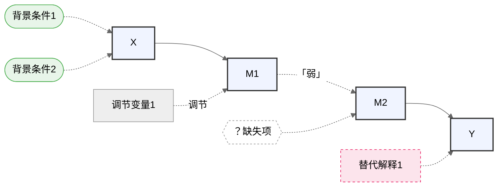
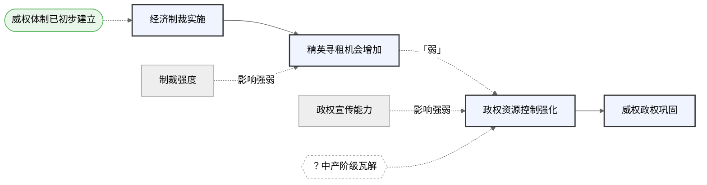

# Causal Mechanism Viz（因果机制图 Mermaid 代码生成）

## 概述

本 skill 的任务：**将箭头化机制与审计结论转译为 Mermaid flowchart 初稿代码**。

操作原则：
- 不新增变量，不改写主链
- 严格按照审计结论决定各类元素的图形位置
- 输出完整可运行的 Mermaid 代码 + 图例说明
- 这是初稿代码，供研究者进一步调整，不是最终定稿

---

## 输入格式

接收来自 causal-mechanism-audit 的以下内容：

```
【主链】
X → M1 → M2 → Y

【背景条件】
（审计后建议画入图中的背景条件）

【调节变量】
（审计后建议画入图中的调节变量，注明对应箭头）

【替代解释】
（审计后建议画入图中的替代解释，注明指向）

【最弱环节】
（审计判断的最弱箭头）

【看不见的缺失】
（审计判断需要画入图中的缺失项）
```

若用户未提供审计结论（直接从箭头化结果绘图），仍可执行，但跳过最弱环节标注和问号节点，在备注中说明。

---

## Mermaid 图形语法规则

### 节点类型对应表

| 元素类型 | Mermaid 语法 | 视觉效果 |
|----------|-------------|---------|
| 主链节点 | `ID["节点名"]` | 实线矩形 |
| 背景条件 | `ID(["背景条件名"])` | 椭圆形（放主链上方） |
| 调节变量 | `ID["调节变量名"]` + 虚线连接 | 矩形 + 虚线 |
| 替代解释 | `ID["替代解释名"]` + 虚线箭头 | 矩形 + 虚线箭头 |
| 最弱环节箭头 | `--弱?-->` 或 `-.->` | 虚线箭头 |
| 问号缺失节点 | `ID{{"？缺失项"}}` | 六边形虚框 |

### 箭头类型

| 箭头含义 | Mermaid 语法 |
|----------|-------------|
| 主链因果箭头（实线） | `-->` |
| 调节变量连接（虚线，无箭头） | `-.->` 或 `---` |
| 替代解释路径（虚线箭头） | `-.->` |
| 最弱环节（虚线箭头 + 标注） | `-. 弱 .->` |
| 问号节点连接（虚线） | `-.->` |

### 布局方向

主链从左到右：`graph LR`

背景条件放主链上方：先声明背景条件节点，再用虚线连接到主链第一个节点（或整条链的起点区域）。

---

## 操作步骤

### Step 1：声明所有节点 ID

为每个元素分配简短的英文 ID（避免中文 ID 导致渲染问题）：

```
主链：X, M1, M2, Y（依此类推）
背景条件：BC1, BC2
调节变量：MOD1, MOD2
替代解释：ALT1, ALT2
问号节点：Q1, Q2
```

### Step 2：构建主链


### Step 3：添加背景条件

背景条件用椭圆节点，放在主链上方，用虚线连向 X（或第一个受其影响的节点）：

```
BC1(["背景条件名"]) -.-> X
```

### Step 4：添加调节变量

调节变量连向对应箭头的目标节点，用虚线，标注"调节"：

```
MOD1["调节变量名"] -. 调节 .-> M1
```

若调节变量影响特定箭头（如 M1→M2），连向该箭头的终点节点，并在标注中说明：

```
MOD1["调节变量名"] -. 影响M1→M2 .-> M2
```

### Step 5：标注最弱环节

将最弱箭头改为虚线，并加标注：

```
M1 -. 「弱」 .-> M2
```

注意：最弱环节节点本身保留在主链中，只改箭头样式。

### Step 6：添加替代解释

替代解释作为旁支，用虚线箭头指向其可解释的节点（通常是 Y 或某个中间节点）：

```
ALT1["替代解释名"] -.-> Y
```

### Step 7：添加问号缺失节点

问号节点用六边形，插入对应位置，用虚线连接：

```
Q1{{"？缺失项名"}} -.-> M2
```

### Step 8：添加样式

用 `classDef` 统一视觉风格：

```
classDef main fill:#f0f4ff,stroke:#333,stroke-width:2px
classDef weak fill:#fff3cd,stroke:#ff9800,stroke-width:2px,stroke-dasharray:5 5
classDef bg fill:#e8f5e9,stroke:#4caf50,stroke-width:1px
classDef alt fill:#fce4ec,stroke:#e91e63,stroke-width:1px,stroke-dasharray:4 4
classDef missing fill:#fff,stroke:#999,stroke-width:1px,stroke-dasharray:3 3

class X,M1,M2,Y main
class M1_weak weak    %% 若M1→M2为最弱，可单独标记该节点
class BC1,BC2 bg
class ALT1 alt
class Q1 missing
```

---

## 完整输出模板

````


【图例说明】
- 实线矩形（蓝底）：主链节点，核心因果传导环节
- 实线箭头 →：主链因果箭头
- 虚线箭头「弱」标注：最弱环节，需要补充实证支撑
- 椭圆（绿底）：背景条件，机制启动的前提，不在主链中流动
- 矩形 + 虚线连接：调节变量，影响对应箭头的强弱或速度
- 矩形（粉底）+ 虚线箭头：替代解释，独立可解释结果的竞争路径
- 六边形（虚线框）：问号节点，逻辑断裂处的显式标记，尚待实证
````

---

## 常见问题处理

**问题1：节点名称包含中文特殊字符导致渲染失败**
解决：节点名放入引号内，如 `X["经济制裁实施"]`，避免使用括号、冒号等特殊符号。

**问题2：调节变量不知道连向哪个节点**
原则：连向该调节变量所影响的箭头的**终点节点**，并在标注中注明"影响X→M1"。

**问题3：替代解释指向中间节点还是 Y**
原则：替代解释若能独立解释最终结果 Y，连向 Y；若只影响某中间环节，连向该节点。

**问题4：主链超过4个节点，图形过于拥挤**
解决：主链节点缩短至4字以内；将调节变量和替代解释移至图下方子图，或分两张图输出（主图 + 辅助图）。

**问题5：有两条并行主链（分叉机制）**
解决：两条链共享 X 起点，分叉后各自延伸至 Y，用注释标明路径A/路径B：

```
X --> M1a["M1a（路径A）"]
X --> M1b["M1b（路径B）"]
M1a --> Y
M1b --> Y
```

---

## 示例

**输入**（来自制裁案例审计结论）：

```
【主链】经济制裁实施 → 精英寻租机会增加 → 政权资源控制强化 → 威权政权巩固
【背景条件】威权体制已初步建立
【调节变量】政权宣传能力（影响M1→M2）；制裁强度（影响X→M1）
【替代解释】无需入图（制裁协调失败可文字交代）
【最弱环节】M1→M2
【看不见的缺失】中产阶级瓦解路径（问号节点，位于M1与M2之间）
```

**输出**：

````


【图例说明】
- 实线矩形（蓝底）：主链节点
- 实线箭头：主链因果传导
- 虚线箭头「弱」标注：M1→M2 为最弱环节，需补充时间顺序证据
- 椭圆（绿底）：背景条件，机制启动前提
- 矩形 + 虚线：调节变量，影响对应箭头强弱
- 六边形（虚线框）：问号节点，中产阶级瓦解路径尚待实证确认
````

---

## 兼容性说明（Typora / Obsidian 等本地渲染工具）

生成的 Mermaid 代码在以下环境中可直接渲染：

| 环境 | 注意事项 |
|------|---------|
| **Typora** | 直接粘贴 ```` ```mermaid ```` 代码块即可渲染。`%%{init: {'theme': 'neutral'}}%%` 确保深浅色主题均可见。 |
| **Obsidian** | 同上。确保笔记设置中 Mermaid 已启用（默认开启）。如遇深色主题下颜色对比度不足，可调整 `%%{init}%%` 中的 theme 值为 `'dark'` 或 `'base'`。 |
| **GitHub Markdown** | 需移除 `%%{init}%%` 行（GitHub 不支持 init 指令），其余语法完全兼容。 |
| **Mermaid Live Editor** | 完全兼容。 |

### 已知的渲染风险

1. **`%%{init}%%` 指令**：部分较旧的 Mermaid 版本（< 8.5）不支持。若渲染失败，删除首行的 `%%{init: {'theme': 'neutral'}}%%` 即可。
2. **中文节点名**：已用双引号包裹（如 `X["节点名"]`），所有主流渲染器均支持。
3. **六边形节点 `{{}}`**：语法在 Mermaid 8.7+ 引入，若渲染器版本过低，替换为矩形节点 `["？缺失项"]`。
4. **深色主题**：`%%{init: {'theme': 'neutral'}}%%` 使用中性背景色，避免深色模式下浅色填充（如 `#f0f4ff`）与背景冲突。若仍需调整，在 Obsidian 的"Settings → Appearance → CSS snippets"中添加自定义 Mermaid 样式。
