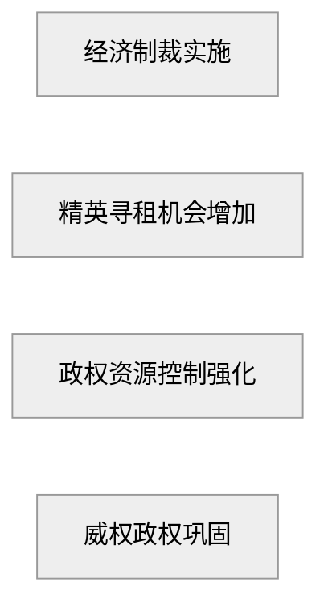
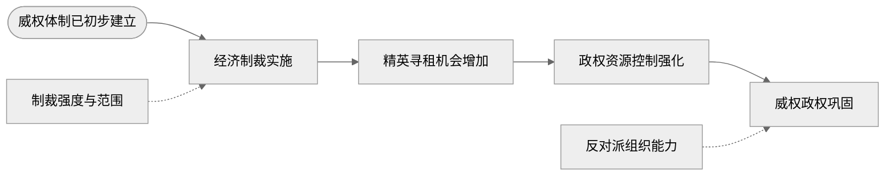
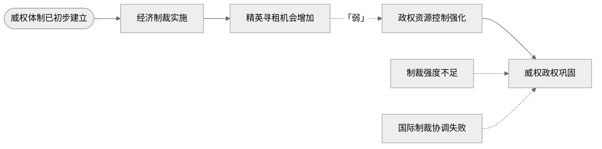
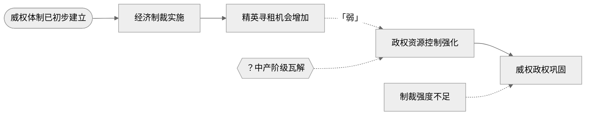
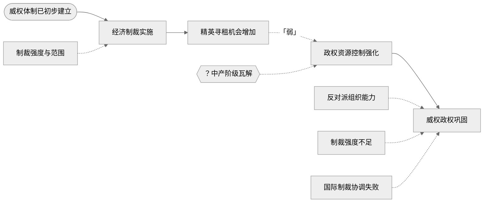
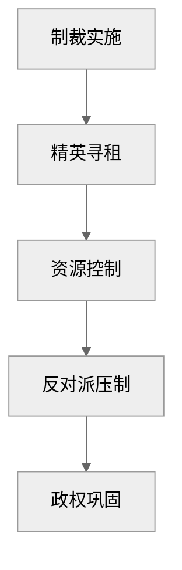
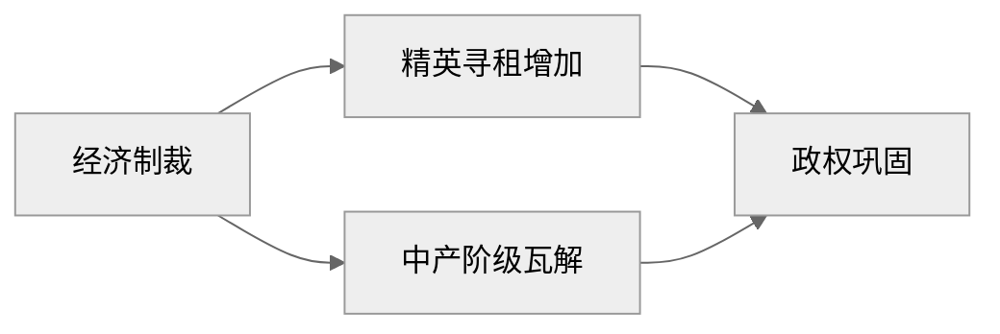

[← 上一步：因果审计](./02-audit.md) • [↑ 工作流总览](./00-overview.md) • [查看 AI Skill →](../skills/causal-mechanism-viz.md) • [下一步：图形审查 →](./04-graph-audit.md)

---

# Step 3：输出 Mermaid 初稿代码（Viz Generator）

## 概述

核心任务：**将 Step 2 的审计结论转译为 Mermaid flowchart 代码。**

此步骤遵循三条铁律：
- **不新增变量**——审计结论中未出现的元素不得擅自添加
- **不改写主链**——审计后确认的主链结构必须原样保留
- **输出初稿 + 图例**——初稿是"机器说的"，留待 Step 4 审查和 Step 5 人工修改

操作原则：
- 每个 Mermaid 节点对应一个因果元素（主链节点、背景条件、调节变量等）
- 箭头方向与因果方向一致（从左到右 `graph LR`）
- 图例必须附在代码下方，用文字说明各类节点的视觉含义
- 代码块前后加 `%%{init: {'theme': 'neutral'}}%%` 控制全局样式

---

## 输入格式

来自 Step 2 审计结论，包含以下六个部分：

| 审计模块 | 包含内容 | 对应图元 |
|----------|----------|----------|
| **主链** | X → M1 → M2 → Y（审计确认后的版本） | 实线矩形节点 + 实线箭头 |
| **背景条件** | 机制成立所需的范围条件 | 椭圆形节点 + 实线箭头指向首个受影响节点 |
| **调节变量** | 影响机制强弱/速度的因素 | 矩形节点 + 虚线箭头指向受影响箭头 |
| **替代解释** | 用户提及但排除的竞争性解释 | 矩形节点 + 虚线箭头指向主链末端 |
| **最弱环节** | 审计中识别的因果链条中最不牢固的箭头 | 虚线箭头 + 「弱」标签 |
| **看不见的缺失** | 审计中认为可能存在但无法确认的缺失因素 | 六边形虚框节点 + 虚线箭头 |

---

## Mermaid 图形语法规则

### 节点类型对应表

| 元素类型 | Mermaid 语法 | 视觉效果 |
|----------|-------------|----------|
| 主链节点 | `ID["节点名"]` | 实线矩形 |
| 背景条件 | `ID(["背景条件名"])` | 椭圆形 |
| 调节变量 | `ID["变量名"]` + 虚线箭头 | 矩形 + 虚线 |
| 替代解释 | `ID["解释名"]` + 虚线箭头 | 矩形 + 虚线箭头 |
| 最弱环节 | `-. 「弱」 .->` | 虚线箭头 + 文本标签 |
| 问号缺失 | `ID{{"？缺失"}}` | 六边形虚框 |

### 箭头类型

| 箭型 | 语法 | 用途 |
|------|------|------|
| 实线箭头 | `-->` | 主链因果传导 |
| 虚线箭头 | `-.->` | 调节变量 / 替代解释 / 缺失节点 |
| 带标签虚线箭头 | `-. 「弱」 .->` | 最弱环节标记 |
| 带标签实线箭头 | `-- "文本" -->` | 主链补充说明（可选） |

### 布局方向


`graph LR`（Left to Right）是默认方向。若主链过长（超过 6 个节点），可考虑 `graph TD`（Top to Down）。

---

## 操作步骤

以下每一步都给出对应的 Mermaid 代码示例，基于制裁审计案例。

### Step 1：声明节点 ID

为每个元素分配唯一的节点 ID。命名约定：
- 主链：`X`, `M1`, `M2`, ..., `Y`
- 背景条件：`B1`, `B2`, ...
- 调节变量：`Z1`, `Z2`, ...
- 替代解释：`A1`, `A2`, ...
- 缺失节点：`Q1`, `Q2`, ...



### Step 2：构建主链

将 Step 1 的节点用 `-->` 连接。一条完整的因果链必须从头到尾单向流动。


### Step 3：添加背景条件

背景条件用 `ID(["文字"])` 椭圆形语法。背景条件通常连接主链首节点，表示"在此条件下，主链启动"。


### Step 4：添加调节变量

调节变量用 `-.->` 虚线箭头指向它影响的**箭头**（而非节点）。Mermaid 无法直接标记箭头上的调节变量，所以通常做法是：调节变量节点 → 用虚线指向目标节点，并在节点名称中体现调节含义。



### Step 5：标记最弱环节

用 `-. 「弱」 .->` 替换审计认定的最弱箭头。被标记的箭头从实线变为虚线，并添加「弱」字标签。


### Step 6：添加替代解释

替代解释用虚线箭头指向主链末端（Y），表示"另一种可能的解释指向同一结果"。



### Step 7：添加问号缺失节点

审计认定的"可能缺失"用六边形 `ID{{"？缺失"}}` 表示。虚线箭头指向推测可能插入的位置。



### Step 8：添加样式（可选）

Mermaid 支持通过 `style` 语句自定义节点样式。建议只在初稿中保留干净的布局，样式调整留到 Step 5 人工修改。


---

## 完整输出模板

```markdown
## Mermaid 初稿代码



### 图例说明

| 图元 | 含义 |
|------|------|
| `矩形` | 主链节点（因果链核心环节） |
| `椭圆形` | 背景条件（机制启动的前提） |
| `矩形 + 虚线箭头` | 调节变量（影响机制强弱/方向） |
| `矩形 + 虚线箭头→Y` | 替代解释（竞争性假设） |
| `虚线箭头 + 「弱」` | 最弱环节（审计认定的因果薄弱点） |
| `六边形虚框` | 可能缺失（审计中识别的潜在缺口） |
```

---

## 兼容性说明

不同渲染环境对 Mermaid 的支持程度不同，以下为已知兼容性问题：

| 环境 | 注意事项 |
|------|----------|
| **Typora** | 原生支持 Mermaid，`%%{init: {'theme': 'neutral'}}%%` 在新版中正常工作。若 init 指令失效，可去掉该行，Typora 会使用默认主题。 |
| **Obsidian** | 需要安装 "Mermaid" 或 "Obsidian Mermaid" 插件。六边形节点 `ID{{"文字"}}` 在部分旧版插件中渲染异常，可改用矩形加问号前缀替代。 |
| **GitHub Markdown** | 支持 Mermaid（2022 年起）。`%%{init: ...}%%` 指令在 GitHub 上可能会被忽略（fallback 到默认主题），不影响图形结构。中文节点名测试通过。 |
| **Mermaid Live Editor** | 最完整的测试环境（[mermaid.live](https://mermaid.live)）。建议初稿完成后在此预览。支持 init 指令和全部节点类型。 |

### 已知渲染风险

1. **init 指令版本要求**：`%%{init: ...}%%` 需要 Mermaid v8.6+。Typora 和 GitHub 已支持，但若使用旧版插件可能无效。安全做法：去掉 init 行，代码块本身仍然有效。
2. **中文节点名**：少数旧版渲染器对中文节点名中的特殊字符（如「？」「」）敏感。如遇渲染失败，将中文双引号替换为英文双引号，或简化节点名为 4–6 字。
3. **六边形节点**：`ID{{"文字"}}` 是 Mermaid v10+ 的语法。部分旧环境不支持，可使用 `ID["？文字"]` 矩形加问号前缀作为 fallback。
4. **深色主题**：在深色模式下，Mermaid 默认的文字和连线颜色可能对比度不足。建议在初稿阶段使用 `%%{init: {'theme': 'neutral'}}%%` 确保中立配色。

---

## 常见问题

### 中文特殊字符渲染失败

**问题**：节点名含有中文双引号（""）、中括号（【】）、问号（？）时 Mermaid 报错。

**解决**：使用英文双引号包裹节点名称，将特殊字符替换为拼音或英文。例如将 `"？中产阶级瓦解"` 改为 `"？中产阶级瓦解"`（使用英文双引号即可）。

### 调节变量连向

**问题**：调节变量应该连向"箭头"而非"节点"，但 Mermaid 语法不支持直接标记箭头。

**解决**：将调节变量用虚线箭头指向被调节箭头的终点节点，并在节点名称或图例中说明调节作用。例如 `Z1["制裁强度与范围"] -.-> X` 表示"制裁强度影响制裁实施的传导效果"。

### 替代解释指向

**问题**：替代解释应该指向 Y 还是指向主链中某个特定节点？

**解决**：默认指向 Y（结果）。如果替代解释只在机制中间阶段起作用，可指向对应的 M 节点，并在图例中标注。例如"制裁强度不足"可能是替代解释，它直接导致 Y 不发生，因此连向 Y。

### 主链过长

**问题**：主链超过 8 个节点，`graph LR` 一行排不下。

**解决**：
- 切换到 `graph TD`（从上到下布局）
- 将长主链分组，每 3–4 个节点换行
- 减少节点名称字数至 4–6 字
- 或分两行排列（Mermaid 自动折行）



### 并行路径处理

**问题**：审计结论中包含两条并行机制路径。

**解决**：使用两条独立的主链分支，在分叉处合并或分叉。



---

## 示例（制裁案例完整输出）

以下为制裁案例的完整 Mermaid 初稿代码。对应完整的审计结论和箭头骨架，详见 [制裁案例完整文档](../examples/sanctions-case.md)。


**图例说明**：

| 图元 | 含义 |
|------|------|
| `经济制裁实施 → 精英寻租机会增加 → 政权资源控制强化 → 威权政权巩固` | 主链（实线矩形 + 实线箭头） |
| `威权体制已初步建立` | 背景条件（椭圆形） |
| `制裁强度与范围`、`反对派组织能力` | 调节变量（矩形 + 虚线箭头） |
| `制裁强度不足`、`国际制裁协调失败` | 替代解释（矩形 + 虚线箭头指向 Y） |
| `精英寻租机会增加 -. 「弱」 .-> 政权资源控制强化` | 最弱环节（虚线箭头 + 「弱」标签） |
| `？中产阶级瓦解` | 可能缺失（六边形虚框 + 虚线箭头） |

> 完整案例请见 [examples/sanctions-case.md](../examples/sanctions-case.md)

---

## 导航

[← 上一步：因果审计](./02-audit.md) • [↑ 工作流总览](./00-overview.md) • [查看 AI Skill →](../skills/causal-mechanism-viz.md) • [下一步：图形审查 →](./04-graph-audit.md) • [返回 README](../README.md)
