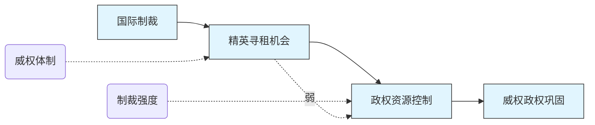

[← 上一步：Mermaid 初稿](./03-viz-generator.md) • [↑ 工作流总览](./00-overview.md) • [查看 AI Skill →](../skills/causal-mermaid-graph-audit.md) • [下一步：人工修改终稿 →](./05-reflection-writer.md)

---

# Step 4：图形逻辑审查与修改建议（Graph Audit）

## 概述

核心任务：**对照审计基准（Step 2），逐项检查 Mermaid 初稿（Step 3）是否忠实表达了因果逻辑。** 不重新生成主链，不新增变量，区分语法问题与因果表达问题。

图形审查与因果机制审计（Step 2）的区别：

| 维度 | Step 2 因果审计 | Step 4 图形审查 |
|------|----------------|-----------------|
| 检查对象 | 用户文字中的因果逻辑 | Step 3 生成的 Mermaid 代码 |
| 核心问题 | "机制是否完整？" | "图是否把机制画对了？" |
| 输出 | 审计意见（文字） | 修改建议（代码级） |
| 是否修改代码 | 否 | 是 |

**关键原则**：本步骤不质疑主链本身的因果逻辑——那是 Step 2 的任务。本步骤只检查 Step 3 的图形化表达是否准确、清晰地反映了 Step 2 已经认可的因果结构。

---

## 输入格式

同时需要以下两项输入，缺一不可：

**① Mermaid 初稿代码**（来自 Step 3）

**② 审计基准**（来自 Step 2），包含：
- 主链（X → M1 → M2 → Y）
- 背景条件列表
- 调节变量列表
- 替代解释列表
- 最弱环节标记
- 看不见的缺失标记

> 若只有 Mermaid 代码而无审计基准，只能执行语法检查及检查 1/2/6，跳过对照类检查（检查 3/4/5/7 的部分项目），并在审查备注中说明。

---

## 七项检查

### 检查 1：背景条件是否误入主链（高优先级）

**错误表现**：背景条件以实线箭头连入主链，或使用矩形节点 `[ ]`。

**正确做法**：背景条件使用椭圆 `( )` + 虚线 `-..->`，不参与主链传导。

| 错误示例 | 正确示例 |
|----------|----------|
| `X[国际制裁] --> B[威权体制] --> M1` | `X[国际制裁] --> M1`<br>`B(威权体制) -..-> M1` |
| 背景条件作为主链节点出现在 X→M1 之间 | 背景条件以虚线指向它调节的第一个节点 |

**判断方法**：检查所有出现在 `->` 或 `-->` 右侧的节点，确认其是否属于主链。如果 Step 2 明确列为背景条件的节点出现在实线箭头链中，判定为 ❌。

---

### 检查 2：调节变量是否被误画为中介机制（高优先级）

**错误表现**：调节变量（如"制裁强度""反对派组织能力"）出现在主链序列中，或以实线箭头与主链连接。

**正确做法**：调节变量平行于箭头放置，使用虚线 `-..->` 指向它所调节的箭头或节点，不进入主链传导序列。

| 错误示例 | 正确示例 |
|----------|----------|
| `X --> M1 --> Mod[制裁强度] --> Y` | `X --> M1 --> Y`<br>`Mod(制裁强度) -..-> M1` |
| 调节变量成为传导中间环节 | 调节变量以虚线指向被调节节点 |

**判断方法**：查阅 Step 2 的调节变量列表，逐一确认其在图中的位置和连线样式。如果调节变量出现在实线箭头链中，判定为 ❌。

---

### 检查 3：替代解释位置与指向（中优先级）

**错误表现**：替代解释使用实线箭头 `-->`，或与主链节点使用相同样式。

**正确做法**：替代解释使用独立样式——虚线箭头 `-..->` + 自定义 classDef（如浅色/灰色），可从旁指向它所替代的主链箭头或节点，也可独立放置并标注"替代解释"。

**判断方法**：检查图中是否有 Step 2 列出的替代解释节点。若存在但样式与主链相同，判定为 ⚠️；若缺失或使用实线箭头，判定为 ❌。

---

### 检查 4：最弱环节是否可视化（中优先级）

**错误表现**：最弱环节（Step 2 中标记的箭头）与其他箭头样式相同，无任何视觉区分。

**正确做法**：最弱环节箭头使用虚线 `-..->` + 添加文字标注「弱」，节点保留在主链中。

**示例**：
```
M1 -.->|弱| M2
```

**判断方法**：对照 Step 2 的最弱环节标记，检查图中对应箭头是否有虚线 + "弱"标注。若无任何区分，判定为 ❌；若区分不够明显（如仅颜色不同但线型相同），判定为 ⚠️。

---

### 检查 5：缺失项是否可视化（中优先级）

**错误表现**：Step 2 标记的"看不见的缺失"在图中完全不存在，或样式与主链节点相同。

**正确做法**：缺失项使用六边形节点 `{{ }}` + 虚线连接，标注为"缺失"或"可能缺失"。

**示例**：
```
{{中产阶级瓦解}} -..-> Y
```

**判断方法**：对照 Step 2 的缺失诊断结果，检查缺失节点是否在图中以特殊样式呈现。若缺失节点完全不存在，判定为 ❌；若存在但样式与主链相同，判定为 ⚠️。

---

### 检查 6：图形复杂度是否掩盖主链（低优先级）

**错误表现**：所有元素（主链、背景条件、调节变量、替代解释、缺失项）使用相同样式，读者无法一眼识别核心因果路径。

**正确做法**：使用 classDef 区分各类元素，主链在视觉上最突出：

| 元素类型 | 建议样式 | classDef 示例 |
|----------|---------|---------------|
| 主链节点 | 实线矩形，深色填充 | `classDef main fill:#e1f5fe,stroke:#333` |
| 背景条件 | 椭圆，虚线连接 | `classDef condition fill:#fff9c4` |
| 调节变量 | 椭圆，虚线连接 | `classDef moderator fill:#f3e5f5` |
| 替代解释 | 矩形，浅色/灰色虚线框 | `classDef alternative fill:#f5f5f5,stroke-dasharray:5 5` |
| 缺失项 | 六边形，虚线连接 | `classDef missing fill:#ffebee,stroke:#c62828` |

**判断方法**：观察图中是否至少有 3 种不同的视觉样式。若所有节点完全相同，判定为 ⚠️；若虽有区分但主链不够突出，给出改进建议。

---

### 检查 7：Mermaid 语法渲染风险（高优先级）

检查以下常见语法错误，这些错误可能导致 Mermaid 渲染失败或显示异常：

| 检查项 | 风险级别 | 说明 |
|--------|---------|------|
| 节点 ID 重复 | ❌ | 不同节点使用相同 ID 会导致覆盖 |
| 特殊字符 | ❌ | 节点文本中含 `()`, `[]`, `{}` 等 Mermaid 保留字符 |
| 保留关键词 | ⚠️ | 如 `graph`, `subgraph`, `end`, `classDef` 作为节点内容 |
| classDef 引用未声明节点 | ❌ | 对不存在的节点 ID 应用 classDef |
| 标注含特殊字符 | ⚠️ | 箭头标注 `|文本|` 中含 `|` 或其他保留符 |
| 中文括号/引号 | ⚠️ | 混用全角括号可能被 Mermaid 解析异常 |
| 子图（subgraph）嵌套错误 | ❌ | subgraph 未正确闭合 |
| 箭头方向拼写 | ❌ | 如 `-->` 误写为 `-->`（多余空格）或 `- >` |

**判断方法**：逐行检查 Mermaid 代码（可用在线渲染器或本地渲染工具验证），记录所有渲染风险。

---

## 输出格式

审查报告按以下顺序输出：

### 1. 语法检查列表

以列表形式列出所有发现的语法风险。

```
- [✅] 节点 ID 无重复
- [❌] 节点"制裁强度"含特殊字符（`[` 和 `]`）
- [⚠️] 箭头标注含中文引号
...
```

### 2. 因果表达检查表

以表格形式呈现，**只列出有问题的检查项**（✅ 项不出现在列表中）：

| 检查项 | 状态 | 问题描述 | 修改建议 |
|--------|------|----------|----------|
| 检查 1：背景条件位置 | ❌ | "威权体制"以 `-->` 连入主链 | 改为 `(威权体制) -..-> M1` |
| 检查 2：调节变量样式 | ⚠️ | "制裁强度"使用矩形而非椭圆 | 改为 `(制裁强度)` |
| 检查 4：最弱环节标记 | ❌ | 最弱箭头无标注 | 添加 `-.->|弱|` |
| ... | ... | ... | ... |

**状态标准**：
- ✅ **无问题**——不出现列表中
- ⚠️ **轻微**——建议修改但不影响因果表达
- ❌ **必须修改**——错误的因果表达或渲染失败风险

### 3. 修改优先级

按优先级排序所有修改建议：

```
【高优先级】必须修改
1. 检查 1：背景条件"威权体制"误入主链 → 改为虚线椭圆
2. 检查 7：节点 ID 重复 → 重命名
...

【中优先级】建议修改
3. 检查 4：最弱环节无标注 → 添加"弱"标注
...

【低优先级】可优化
4. 检查 6：主链与辅助元素样式未区分 → 添加 classDef
```

### 4. 修改后代码片段

提供修正后的完整 Mermaid 代码片段（仅展示被修改部分，用注释标记改动处）：



---

## 常见陷阱

| 陷阱 | 说明 |
|------|------|
| **语法正确 ≠ 逻辑正确** | Mermaid 渲染无误不代表图形准确表达了因果机制。检查 1-6 才覆盖逻辑层面。 |
| **复杂度问题应拆图，不删变量** | 如果图形因辅助元素过多而难以阅读，应拆分为子图（subgraph）或分图展示，而非直接删除辅助元素。 |
| **只给逐条修改指令** | 审查报告应给出可操作的、逐条的修改指令（改哪里、改成什么），而非笼统的"这个图需要改进"。 |
| **✅ 项不出现在列表中** | 无问题的检查项不列入因果表达检查表，保持列表简洁，只呈现需要关注的问题。 |
| **区分归因于 Step 2 的问题** | 如果发现主链本身有问题（如遗漏重要节点），应指出此问题应回到 Step 2 重新审计，而非在本步骤修补。本步骤只做图形化表达层面的修正。 |
| **不要重新生成主链** | 本步骤不新增、不删除、不重新排列主链节点。任何主链层面的变更都应返回 Step 2 处理。 |

---

## 指向完整案例

> 完整走通案例见 [examples/sanctions-case.md](../examples/sanctions-case.md)。

---

## 导航

[← 上一步：Mermaid 初稿](./03-viz-generator.md) • [↑ 工作流总览](./00-overview.md) • [查看 AI Skill →](../skills/causal-mermaid-graph-audit.md) • [下一步：人工修改终稿 →](./05-reflection-writer.md) • [返回 README](../README.md)
